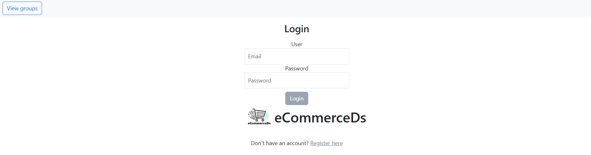

## AngulareCommerceDs_20
This project was generated with [Angular CLI](https://github.com/angular/angular-cli) version 20.1.2.

**AngulareCommerceDs_20** is an e-commerce application developed with Angular. Its main purpose is to allow users to browse and purchase albums from different musical groups and genres, as well as manage their orders and shopping carts. The application has two main areas of functionality: one for general users and one for administrators. For general users (Registration and Login, Product Navigation, Shopping Cart, and Order Management). For administrators (Genre Management, Group Management, Album Management, User Management, Order Management (Admin), and Cart Management (Admin).


AngulareCommerceDs_20/  
├───app/  
│   ├───ecommerce/  
│   │   ├───AdminOrders/  
│   │   │   ├───AdminOrdersComponent.css  
│   │   │   ├───AdminOrdersComponent.html  
│   │   │   └───AdminOrdersComponent.ts  
│   │   ├───CartDetails/  
│   │   │   ├───CartDetailsComponent.css  
│   │   │   ├───CartDetailsComponent.html  
│   │   │   └───CartDetailsComponent.ts  
│   │   ├───carts/  
│   │   │   ├───CartsComponent.css  
│   │   │   ├───CartsComponent.html  
│   │   │   └───CartsComponent.ts  
│   │   ├───genres/  
│   │   │   ├───GenresComponent.html      
│   │   │   └───GenresComponent.ts  
│   │   ├───groups/  
│   │   │   ├───GroupsComponent.html      
│   │   │   └───GroupsComponent.ts  
│   │   ├───listgroups/  
│   │   │   ├───ListgroupsComponent.html            
│   │   │   └───ListgroupsComponent.ts  
│   │   ├───listrecords/  
│   │   │   ├───ListrecordsComponent.html      
│   │   │   └───ListrecordsComponent.ts  
│   │   ├───orders/  
│   │   │   ├───OrdersComponent.html  
│   │   │   └───OrdersComponent.ts  
│   │   ├───records/  
│   │   │   ├───RecordsComponent.css  
│   │   │   ├───RecordsComponent.html  
│   │   │   └───RecordsComponent.ts  
│   │   ├───services/  
│   │   │   ├───CartService.ts  
│   │   │   ├───CartDetailService.ts  
│   │   │   ├───GenresService.ts  
│   │   │   ├───GroupsService.ts  
│   │   │   ├───OrderService.ts  
│   │   │   ├───RecordsService.ts  
│   │   │   ├───StockService.ts  
│   │   │   └───UsersService.ts  
│   │   ├───users/  
│   │   │   ├───UsersComponent.html  
│   │   │   └───UsersComponent.ts  
│   │   ├───EcommerceComponent.html  
│   │   ├───EcommerceComponent.ts  
│   │   ├───EcommerceInterface.ts    
│   ├───guards/  
│   │   └───AuthGuardService.ts  
│   ├───interfaces/  
│   │   ├───LoginInterface.ts  
│   │   └───RegisterInterface.ts  
│   ├───services/  
│   │   ├───AppService.ts  
│   │   └───UserService.ts  
│   ├───shared/  
│   │   ├───login/  
│   │   │   ├───LoginComponent.css  
│   │   │   ├───LoginComponent.html  
│   │   │   └───LoginComponent.ts  
│   │   ├───navbar/  
│   │   │   ├───NavbarComponent.html  
│   │   │   └───NavbarComponent.ts  
│   │   ├───register/  
│   │   │   ├───RegisterComponent.css  
│   │   │   ├───RegisterComponent.html  
│   │   │   └───RegisterComponent.ts  
│   ├───AppComponent.html    
│   ├───AppComponent.ts       
│   └───AppRoutes.ts    
├───environments/  
│   ├───environment.development.ts  
│   └───environment.ts  
├───main.ts     
├───angular.json   
└───package.json    





## environment

```javascript
export const environment = {
  urlAPI: 'https://localhost:7190/api/',
};

```

[DeepWiki moraisLuismNet/AngulareCommerceDs_20](https://deepwiki.com/moraisLuismNet/AngulareCommerceDs_20)


## Development server

Run `ng serve` for a dev server. Navigate to `http://localhost:4200/`. The application will automatically reload if you change any of the source files.

## Code scaffolding

Run `ng generate component component-name` to generate a new component. You can also use `ng generate directive|pipe|service|class|guard|interface|enum|module`.

## Build

Run `ng build` to build the project. The build artifacts will be stored in the `dist/` directory.

## Running unit tests

Run `ng test` to execute the unit tests via [Karma](https://karma-runner.github.io).

## Running end-to-end tests

Run `ng e2e` to execute the end-to-end tests via a platform of your choice. To use this command, you need to first add a package that implements end-to-end testing capabilities.

## Further help

To get more help on the Angular CLI use `ng help` or go check out the [Angular CLI Overview and Command Reference](https://angular.io/cli) page.

